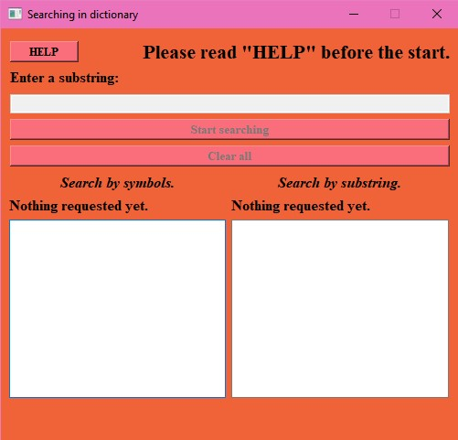

# Dictionary
## internship project  
Проект написан и собран в Qt Creator 4.13.0 (основан на Qt 5.15.0) 
JBexe - папка с исполняемым файлом и всеми необходимыми для него библиотеками. 
JBpro - папка проекта собранного в QT, в ней находятся откомментированные .cpp и .h - файлы. 
Проектом является программа, в которой реализован поиск подстроки в словах словаря (словарь взят из файла words.txt, предоставленного в описании программы стажировки). В программе производится обработка каждого слова из словаря на предмет содержания в очередном слове введенной пользоваетелем подстроки. В программе реализованы 2 вида поиска: поиск по целой подстроке (прим. **cat** - bob**cat**) и поиск по последовательным символам (прим. **cat** - **c**lim**at**). Количество совпадений слов по каждому из реализованных видов поиска подсчитывается в процессе выполнения программы, а по её завершении подсчитывается общее количество найденных слов. Обработка производится последовательно, то есть проход по всему файлу осуществляется только один раз (обрабатывается первое слово, затем второе и так далее). Также сами слова выводятся на экран списком и с выделением красным цветом букв подстроки, вводимой пользователем. Поиск подстроки можно производить многократно. Также реализована проверка вводимой подстроки, так как в подстроке могут содержаться только буквы английского алфавита.

